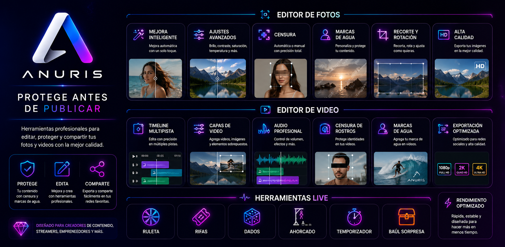

# ANURIS

## Protect your identity before you publish.

Professional content protection software for **Windows** and **Android**.

Automatic Face Censorship • Intelligent Watermarks • Photo Editor • Video Editor • Live Tools

🌐 **Official Website**

**https://lianur.net**

🇬🇧 **English** | 🇪🇸 *Español (coming soon)*

---

**Windows • Android • Flutter • OpenCV • FFmpeg**

---

# What is ANURIS?

ANURIS is professional multimedia software developed by **Lianur Systems** to help content creators protect their privacy before publishing photos or videos.

Instead of using multiple applications, ANURIS combines face censorship, intelligent watermarking, photo editing, video editing and live content tools into a single solution.

Whether you want to protect your identity, personalize your content or reduce unauthorized sharing, ANURIS provides powerful tools designed for modern content creators.

---

# Why use ANURIS?

Publishing content without protection may expose your identity or allow unauthorized redistribution.

ANURIS helps you:

- Protect your privacy.
- Automatically or manually censor faces.
- Add intelligent watermarks.
- Edit photos before publishing.
- Edit videos professionally.
- Organize live challenges using integrated tools.

---

# Main Features

| Feature | Windows | Android |
|---------|:-------:|:-------:|
| Automatic Face Censorship | ✅ | ✅ |
| Manual Face Censorship | ✅ | ✅ |
| Adjustable Pixelation | ✅ | ✅ |
| Intelligent Watermark | ✅ | ✅ |
| AI Photo Enhancement | ✅ | ✅ |
| Photo Editor | ✅ | ✅ |
| Video Editor | ✅ | ✅ |
| Multi-track Timeline | ✅ | ➖ |
| Audio Effects | ✅ | ✅ |
| Right-click Context Menu | ✅ | ❌ |
| Keyboard Shortcuts | ✅ | ❌ |
| Live Tools | ✅ | ✅ |

---

# Built for

- Content Creators
- Streamers
- Influencers
- Online Educators
- Privacy Protection
- Social Media Publishing

---

# Windows Edition

The Windows edition has been designed as a professional desktop application.

Features include:

- Professional multi-track timeline
- Right-click context menu
- Keyboard shortcuts
- Audio separation
- Professional exporting
- Automatic face tracking
- Intelligent watermark editor
- Integrated Live Tools

---

# Android Edition

The Android edition allows creators to protect and edit content directly from their mobile devices.

Features include:

- Automatic face censorship
- Manual face censorship
- Intelligent watermarking
- Photo editor
- Video editor
- Live tools

---

# Live Tools

ANURIS includes integrated tools designed for content creators during live broadcasts.

- ✔ Challenge Wheel
- ✔ Giveaway Manager
- ✔ Dice
- ✔ Countdown Timer
- ✔ Hangman
- ✔ Mystery Box

---

# Screenshots

| Dashboard | Photo Editor |
|------------|--------------|
|  |  |

| Video Editor | Live Tools |
|--------------|------------|
|  |  |

---

# Download

🌐 **Official Website**

https://lianur.net

### Windows

➡️ https://lianur.net/anuris-windows.php

### Android

➡️ https://lianur.net/anuris-android.php

---

# Roadmap

## Completed

- ✔ Automatic Face Censorship
- ✔ Manual Face Censorship
- ✔ Intelligent Watermark
- ✔ Windows Edition
- ✔ Android Edition
- ✔ Photo Editor
- ✔ Video Editor
- ✔ Live Tools

## Coming Soon

- Smart Face Selection
- AI Improvements
- Additional Export Formats
- More Editing Tools

---

# Frequently Asked Questions

### Can ANURIS automatically censor faces?

Yes.

ANURIS automatically detects and censors faces in both photos and videos.

---

### Does ANURIS support manual censorship?

Yes.

You can manually censor any area of a photo or video.

---

### Can I add custom watermarks?

Yes.

ANURIS supports customizable text watermarks containing names, aliases, IDs or any custom information.

---

### Is ANURIS available for Windows?

Yes.

ANURIS includes a professional Windows edition specifically designed for desktop workflows.

---

# Documentation

Official documentation is available at:

https://lianur.net

---

# License

ANURIS is proprietary commercial software developed by **Lianur Systems**.

The source code is **not publicly available**.

---

# Support

For technical support, licensing or commercial inquiries, visit:

https://lianur.net

---

## Developed by Lianur Systems

### https://lianur.net

**Protect your identity before you publish.**

---

© 2026 Lianur Systems. All rights reserved.

