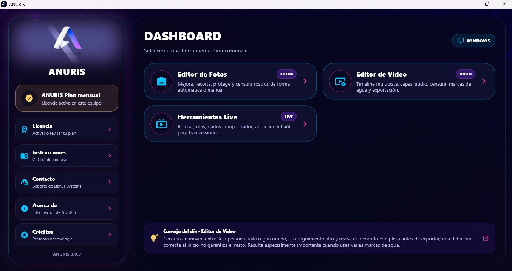
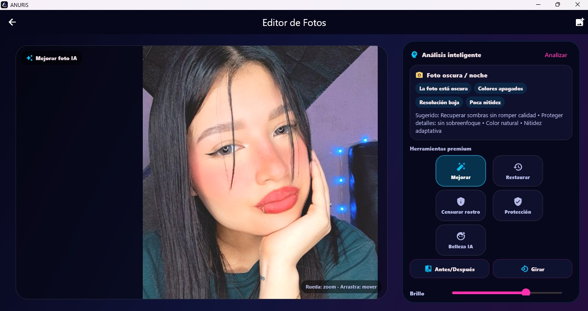
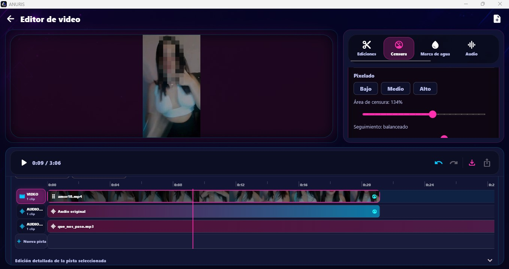
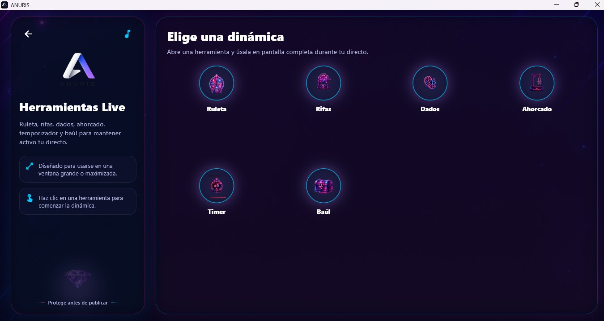

# ANURIS

## Protect your identity before you publish.

Professional content protection software for **Windows** and **Android**.

Automatic Face Censorship • Intelligent Watermarks • Photo Editor • Video Editor • Live Tools

🌐 Official Website

https://lianur.net

🇬🇧 English | 🇪🇸 Español *(coming soon)*

---

Windows • Android • Flutter • OpenCV • FFmpeg

---

# What is ANURIS?

ANURIS is professional multimedia software developed by **Lianur Systems** to help content creators protect their privacy before publishing photos or videos.

Instead of using multiple applications, ANURIS combines face censorship, watermarking, photo editing, video editing and live content tools in a single solution.

Whether you want to protect your identity, personalize your content or reduce unauthorized sharing, ANURIS provides powerful tools designed for creators.

---

# Why use ANURIS?

Publishing content without protection may expose your identity or allow unauthorized redistribution.

ANURIS helps you:

- Protect your privacy.
- Hide faces automatically or manually.
- Add intelligent watermarks.
- Edit photos and videos before publishing.
- Organize live challenges using integrated tools.

---

# Main Features

| Feature | Windows | Android |
|---------|:-------:|:-------:|
| Automatic face censorship | ✅ | ✅ |
| Manual face censorship | ✅ | ✅ |
| Adjustable pixelation | ✅ | ✅ |
| Intelligent watermark | ✅ | ✅ |
| AI Photo Enhancement | ✅ | ✅ |
| Photo Editor | ✅ | ✅ |
| Video Editor | ✅ | ✅ |
| Multi-track Timeline | ✅ | ➖ |
| Audio Effects | ✅ | ✅ |
| Right-click Menu | ✅ | ❌ |
| Keyboard Shortcuts | ✅ | ❌ |
| Live Tools | ✅ | ✅ |

---

# Built for

- Content creators
- Streamers
- Influencers
- Online educators
- Privacy protection
- Social media publishing

---

# Windows Edition

The Windows edition has been designed as a professional desktop application.

Features include:

- Multi-track timeline
- Right-click context menu
- Keyboard shortcuts
- Audio separation
- Professional export
- Automatic face tracking
- Intelligent watermark editor
- Live tools

---

# Android Edition

The Android edition allows creators to protect and edit content directly from their mobile devices.

Features include:

- Face censorship
- Watermarks
- Photo editor
- Video editor
- Live tools

---

# Live Tools

ANURIS includes integrated tools designed for content creators during live broadcasts.

✔ Challenge Wheel

✔ Giveaway Manager

✔ Dice

✔ Countdown Timer

✔ Hangman

✔ Mystery Box

---

# Screenshots

## Dashboard

---

## Photo Editor

---

## Video Editor

---

## Live Tools

# Download

Official website

https://lianur.net

Windows

https://lianur.net/anuris-windows.php

Android

https://lianur.net/anuris-android.php

---

# Roadmap

Completed

- Automatic face censorship
- Manual face censorship
- Intelligent watermark
- Windows edition
- Android edition
- Photo editor
- Video editor
- Live tools

Coming soon

- Face selection before censorship
- AI improvements
- Additional export formats
- More editing tools

---

# Frequently Asked Questions

### Can ANURIS automatically censor faces?

Yes.

ANURIS can automatically detect and censor faces in both photos and videos.

### Does ANURIS support manual censorship?

Yes.

You can manually censor any area of a photo or video.

### Can I add custom watermarks?

Yes.

ANURIS supports customizable text watermarks that can include names, aliases, IDs or any other information.

### Is ANURIS available for Windows?

Yes.

ANURIS includes a professional Windows edition specifically designed for desktop workflows.

---

# Documentation

Official documentation is available on:

https://lianur.net

---

# License

ANURIS is proprietary commercial software developed by **Lianur Systems**.

The source code is not publicly available.

---

# Support

Official website

https://lianur.net

---

## Developed by Lianur Systems

https://lianur.net

Protect before you publish.

